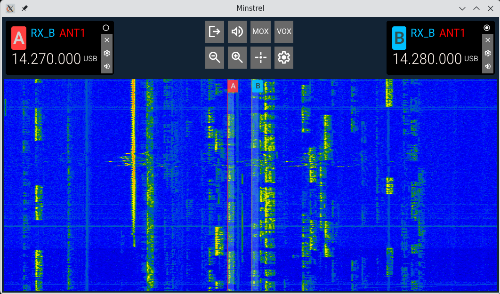
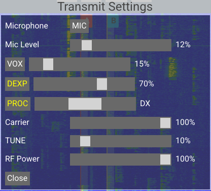

## Minstrel

Minstrel is a GUI app for operating the FLEX-6000 and FLEX-8000 series radios from FlexRadio (i.e. a "SmartSDR clone").
It's made to run on Linux, although it may be usable on other Unix-like systems. Audio support requires PulseAudio or
PipeWire.

## Roadmap

Minstrel is currently Alpha-quality software. It's not a complete replacement for a Copy of SmartSDR or a Maestro. It
has many bugs and limitations. However, it works well enough to make a basic voice QSO with.

### Implemented

* Discovering and connecting to radios on the local network
* Connecting to radios by IP address
* 1 waterfall and up to two slices
* Tuning, changing mode, etc.
* Remote audio (using a headset or speakers/mic attached to your PC)
* PTT using onscreen buttons or the spacebar
* VOX
* Phone-related transmit settings
    * RF Power
    * Mic selection
    * Mic level
    * Speech processor
    * Compressor (DEXP)
    * VOX
    * AM carrier level
* MIDI controller support for tuning, volume adjustment, and PTT

### Planned

* CW support
* A lot more settings
* Meters
* GPIO PTT on Raspberry Pi
* Auto connect to last radio

### Currently not planned

* SmartLink

## Building

Install deps. For Ubuntu:

```sh
apt install build-essential golang-go pkg-config libopus-dev libopusfile-dev \
    libasound2-dev libglfw3-dev libxcursor-dev libxinerama-dev libxi-dev \
    libxxf86vm-dev
```

Build:

```sh
go build
```

Run:

```sh
./minstrel
```

## Usage

### Connecting

When you open the program, a list of available radios on the local network will be displayed. Simply click on one to
connect. To connect to a radio that isn't on the local network (if appropriate routes / port forwarding are in place),
choose "Enter IP Address" and enter the IP address or the hostname. SmartLink is not supported.

### The operation (waterfall) display



The waterfall displays signals across the band of interest, as well as displaying where your slices are tuned. The
waterfall can be zoomed in and out using the zoom buttons in the top center of the screen, and scrolled by dragging it.
The "crosshair" button in the top center of the screen will center the waterfall on the active slice.

### Slices

Minstrel currently supports up to two slices, both on the same waterfall. A slice is displayed as a vertical red or
yellow line marking the dial frequency, a shaded area marking the receive passband, and a "flag" displaying the slice's
assigned letter. Slices are also displayed in "slice panels" at the top of the screen. If fewer than two slices are
open, a "+" icon will appear allowing you to create a new slice.

The "active" slice (generally the one most recently interacted with) has a yellow marker and a filled dot in the corner
of its panel. The inactive slice has a red marker and a hollow dot. In the screenshot above, Slice B is active and Slice
A is inactive. The active slice can be changed by clicking on the slice's highlight in the waterfall, or by clicking on
the dot in the corner of the slice panel.

The slice selected for transmit will have a red flag behind its letter, while other slices will have blue flags. You can
change the transmit slice by clicking its flag in the slice panel.

The RX antenna, TX antenna, current frequency, and mode are displayed in the slice panel, and can be changed by clicking
on them. A slice's volume can be changed by clicking on the "speaker" icon in its panel, and a slice can be destroyed
using the X icon.

The currently active slice can also be tuned using the left and right keys on the keyboard, or an attached MIDI controller.

### Remote Audio

To receive audio over the network from the radio and play it on your computer speakers, and send audio from your
computer microphone to the radio, click the "speaker" icon in the top center part of the screen. The icon will light
yellow when active, and can be disabled by clicking it again.

To use the computer microphone for transmission, you also need to set the transmit mic to "PC" (see the next section).

### Transmission

To open the Transmit Settings window, click the "gear" icon in the top center of the screen.



* Microphone: selects the microphone used to transmit.
* Mic Level: Adjusts the mic gain before compression.
* VOX: Enables or disables voice-activated transmit, and sets the VOX threshold. VOX enable/disable is also available
using the VOX button on the main screen.
* DEXP: Enables or disables the "downward expander" to reduce TX background noise, and adjusts its level.
* PROC: Enables or disables the voice processor, and sets the level to Normal, DX, or DX+.
* Carrier: Adjusts the AM carrier level.
* TUNE: Adjusts the tune power.
* RF Power: Adjusts the transmit power.

You can key the PTT using:

* The spacebar
* The MOX button in the top center of the screen
* A MIDI controller
* A footswitch or other device attached directly to the radio
* VOX

### MIDI Controllers

Minstrel supports MIDI controllers for tuning, volume control, and PTT. To configure a MIDI controller:

1. Open the Transmit Settings window (click the "gear" icon)
2. Navigate to the "MIDI" tab
3. Select your MIDI device from the dropdown (or select "None" to disable MIDI)
4. The selected device will be automatically reconnected when you restart Minstrel

MIDI controller functions:
* **Control Change 100** (default): Tune the active slice VFO
* **Control Change 102** (default): Adjust the active slice volume
* **Note 31** (default): PTT (key down to transmit, key up to receive)

The MIDI mapping values can be customized by editing the configuration, but there is no GUI for this yet.

## Tablet Mode

Besides desktops, Minstrel is designed to run on a Raspberry Pi (3 or above) or similar single-board computer with a
MIPI DSI touchscreen display. The minimum resolution required is 720x480, and a size of at least 5 inches is
recommended, or touch targets will be too small. 7 inches is better.

Minstrel can run without any desktop environment, X server, or anything else, by launching it under the
[cage](https://github.com/cage-kiosk/cage) Wayland compositor, and it's possible to boot directly into it by setting it
as the greeter program of [greetd](https://sr.ht/~kennylevinsen/greetd/) or similar.

In the future, a ready-made SD card image will be provided.
